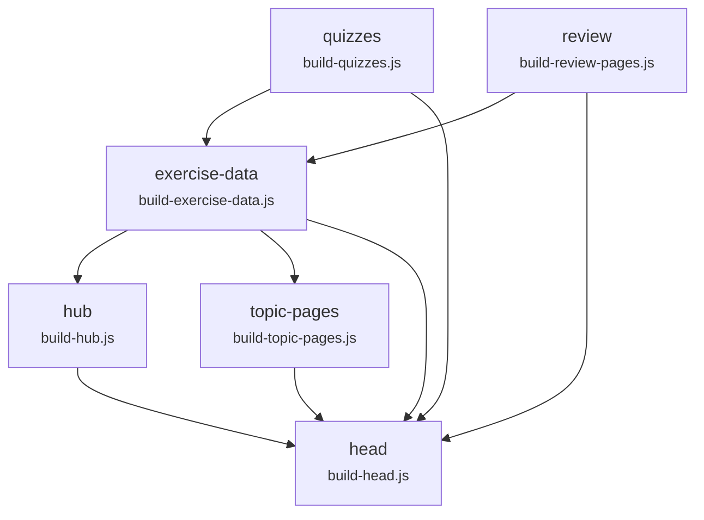

# Loops vs. graphs: how this repo's build pipeline works now

A plain-language walkthrough of `scripts/pipeline.js` + `scripts/build.js` — the
generator pipeline for `data/exercises.json`, `activities.html`, `index.html`,
`themen/`, the review pages, the quiz pages and every page's `<head>` block.
For the design rationale and the investigation that led here, see
[`build-graph-plan.md`](./build-graph-plan.md); this doc is the shorter "what
it is and how to use it" version.

---

## The idea: a loop vs. a graph

Six Node scripts turn authored source files (`*.html`, `data/topics.json`,
`data/explanations.json`, `data/quizzes.json`) into generated output
(`data/exercises.json`, the hub cards, `themen/`, `sitemap.xml`, the review
pages, the shared `<head>` block on every page).

There are two ways to run six scripts that depend on each other:

- **A loop.** One fixed sequence, always run top to bottom, re-run from the
  start if anything looks wrong. The order lives wherever someone last wrote
  it down — a comment, a paragraph in `CLAUDE.md`, a hard-coded list in a CI
  file.
- **A graph.** Each script declares what it reads and what it writes. The
  order is *derived* from those declarations, not remembered, and a script
  that claims a dependency it doesn't actually have — or omits one it does
  have — becomes a build failure instead of a silent bug.

This repo ran as a loop for over a month. `CLAUDE.md` said the order was
`build-exercise-data → build-hub → build-topic-pages → build-head` and that
`build-head` "must run last"; `.github/workflows/rebuild-indices.yml`
hard-coded those same four scripts. Nothing checked either claim.

## What the loop got wrong

Reading each script's actual `readFileSync`/`writeFileSync` calls (not what
the prose claimed) turned up four problems in one pass:

| # | Problem | Consequence |
|---|---------|-------------|
| 1 | **Two scripts missing from CI entirely** — `build-quizzes.js` and `build-review-pages.js` were never in the remembered four, even though their output (16 of 182 entries in `data/exercises.json`) feeds `build-exercise-data.js` | 5 of 12 review pages drifted behind the corpus — `8c-review.html` told students "24 Fragen aus **6** verschiedenen Übungen" when nine source units actually qualified |
| 2 | **Two "fake" edges** — `build-hub` was always run before `build-topic-pages`, and `build-quizzes` before `build-review-pages`, purely by convention. Neither pair reads the other's output; both read the same input and write disjoint files | No real bug yet, but sequencing that carries no data is exactly the kind of rule nobody can verify — it just *looks* meaningful |
| 3 | **One real edge that was never written down anywhere checkable** — `build-head.js` has to run last because every other generator rewrites whole files and drops the `HEAD:*`/`NOSCRIPT:*` block that only `build-head.js` restores | This one was already documented in prose ("must run last") but nothing enforced it |
| 4 | **The safety net had never fired** — `rebuild-indices.yml` had 14 green runs, all triggered by human pushes, and **zero** commits from its own bot account existed in the repo | The workflow existed to self-correct drift and had never once actually done so, because it only ran the four generators people already remembered |

Running the *full* six-script chain against a clean `main` produced a 9-file
diff on the spot — the drift in problem #1 above, plus 4 quiz pages that had
been hand-edited after generation (someone added `<link rel="canonical">` and
better meta descriptions directly to the HTML instead of to
`data/quizzes.json`). That second finding is why the missing scripts couldn't
just be dropped into CI as-is — see "Two static checks" below for how that's
handled now.

## What was built

### `scripts/pipeline.js` — the graph, declared

Six nodes, each naming its `id`, the script it `run`s, the `inputs` it reads
and the `outputs` it writes:



*(This is hand-embedded for readability here; the checked-in source of truth
is the generated [`docs/build-graph.mmd`](./build-graph.mmd) — regenerate it
with `node scripts/build.js --write-graph`, never hand-edit it.)*

Notice `hub` and `topic-pages` no longer have an edge between them, and
`quizzes`/`review` don't either — those were the two fake edges, deleted.
`head` depends on everything, because it's the one real write-after-write
barrier: it walks every page (root *and* `themen/`) and restores the `<head>`
block each upstream generator drops.

Two edge types are supported:

- **`needs`** — a real data or write-after-write edge. It's only valid if the
  parent node's `outputs` actually overlap this node's `inputs` — see the
  fake-edge check below.
- **`after`** — a pure ordering barrier with no overlap requirement, for the
  rare case where two nodes must run in sequence for a reason that isn't data
  flow. **Nothing uses it today** — every edge in the graph carries real
  data — but it exists so a future ordering-only edge doesn't have to be
  faked as a `needs` (which the fake-edge check would then reject).

### `scripts/build.js` — topological sort + two static checks

`build.js` reads the graph, sorts it, and runs every node in that order. It
also runs two checks *before* executing anything, so a bad edge is a build
failure, not a production incident:

1. **Fake-edge check.** For every `needs` edge, does the parent's declared
   `outputs` actually overlap the child's declared `inputs`? If not, the edge
   is asserted but not real — fail the build and name the edge.
2. **Missing-barrier check.** For every *pair* of nodes, if their `outputs`
   overlap (they write some of the same files) but neither is reachable from
   the other in the graph, that's an unordered collision — whichever one
   happens to run second silently clobbers the first. This is the check with
   teeth: deleting `head`'s edges from `pipeline.js` now fails the build with
   four violations, where before that same mistake would have silently
   stripped the `<head>` block off every page.

```
node scripts/build.js                 # validators, then every generator in order
node scripts/build.js --explain       # print the graph + run the checks, execute nothing
node scripts/build.js --check         # build, then fail if the tree or the .mmd is stale
node scripts/build.js --write-graph   # refresh docs/build-graph.mmd
node scripts/build.js hub head        # run just these nodes and everything downstream
```

**Execution is sequential, on purpose.** An earlier draft ran independent
nodes concurrently to save a few seconds. It was dropped: a runtime guard
that only compares `outputs` would still miss a read/write race —
`build-review-pages.js` *reads* `*.html` while `build-head.js` *writes* it,
so running them in parallel could read a half-written file even though their
declared outputs don't overlap. The two static checks catch the same class of
bug for free, without needing concurrency at all, which is where the actual
value was.

### Two CI workflows, two different jobs

- **`rebuild-indices.yml`** — runs on every push to `main` that touches an
  `.html` file, `data/topics.json`, `data/explanations.json`,
  `data/quizzes.json`, `scripts/**.js`, `topic-pool.json` or `exercise.js`.
  Runs `node scripts/build.js` with **no flag** and commits+pushes whatever
  changed, as `eol-index-bot`. Its job is to fix `main`, so it must never fail
  on a dirty tree — a dirty tree is exactly the case it exists to correct.
- **`check-generated.yml`** — the PR gate. Runs `node scripts/build.js
  --explain` (fails on a fake edge or a missing barrier) then `node
  scripts/build.js --check` (fails if committed output differs from what the
  generators actually produce, including a stale `build-graph.mmd`). Its job
  is to stop a PR landing with drift in the first place.

`rebuild-indices.yml`'s `paths:` filter now includes `data/explanations.json`
and `data/quizzes.json` — without those, editing an explanation could never
trigger a rebuild of the review pages generated from it, which is exactly the
gap that let the corpus drift in the first place.

### Validators and checkers — deliberately not graph nodes

Three scripts read only authored, committed state (not another generator's
output), so they run *before* the graph, fail fast, and aren't part of the
dependency structure at all: `validate-explanations.js`, `test-scoring.js`,
`topic-pool.js`.

One script — `validate-schema.js` — reads what the generators just *wrote*,
so it has to run *after* the whole graph, not before. Keeping it out of the
validator list is the point: run early, it would just be inspecting last
run's output and pass on a tree it had never actually seen.

## What stayed out of scope, deliberately

- **Content hashing / incremental builds.** The graph's own logic argues
  against it: per-node pass rate here is effectively 100% and a full build
  takes seconds, so caching would add a new failure mode (staleness) to buy
  nothing.
- **A real build tool** (`make`, `turbo`, `nx`, …). This repo's whole identity
  is "no build system, every file is a standalone HTML page" — bringing in a
  toolchain to orchestrate six Node scripts would trade that away for not
  much.
- **`build-icons.js` / `build-og-card.js`** stay outside the graph (listed as
  `MANUAL` in `pipeline.js`). Their inputs change roughly never,
  `build-og-card.js` needs Playwright (not a repo dependency), and both
  commit their own output by hand.

## Day-to-day: what this means when you add a page

Nothing changes about *when* you run the build — checklist item 10 in
`CLAUDE.md` is still "run `node scripts/build.js` before committing." What
changed is what happens if that step gets skipped or a generator's
input/output declaration goes wrong: it used to fail silently (a stale hub
card, a wrong count on a review page, a stripped `<head>` block) and now it
fails loudly, either locally or at the PR gate, naming the exact edge that's
missing or wrong.

If you add a new generator script, give it a node in `pipeline.js` with real
`inputs`/`outputs` — `build.js` will tell you immediately if an edge you
declared doesn't carry the data you claimed, or if you forgot one that
matters.
